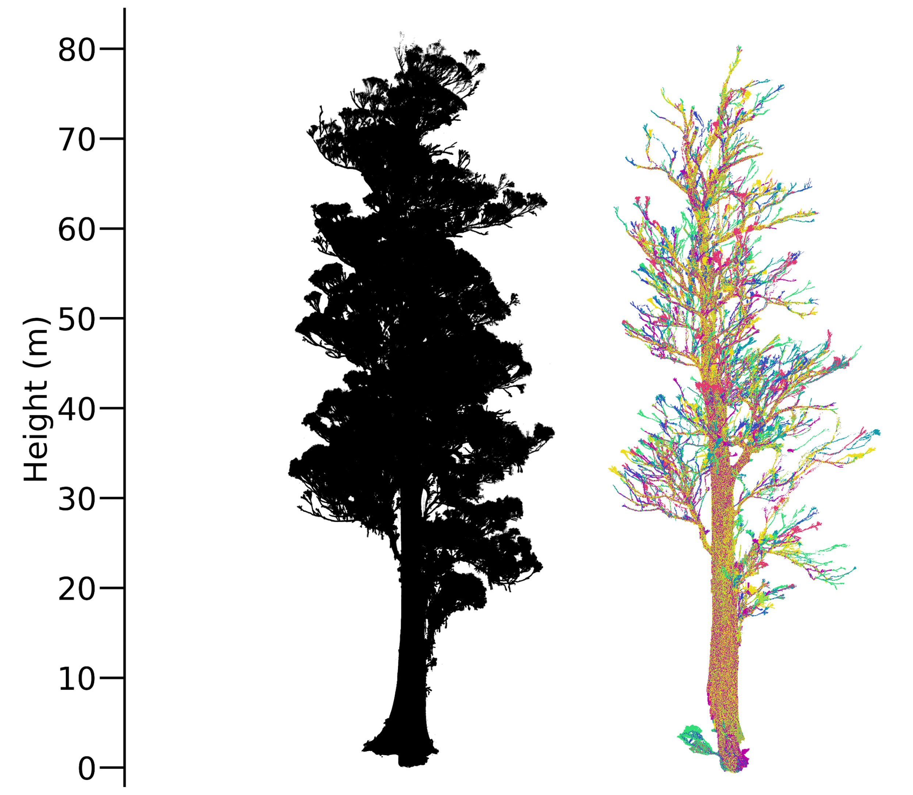

# Manual to run the GBSeparation algorithm for leaf-wood separation

The GBSeparation folder was downloaded in july 2023 from https://zenodo.org/record/6837613. Some slight modification have been done.

## Steps
### Get the code

1. Download this Github repo. OR download the original code (rar file on https://zenodo.org/record/6837613) and unzip, and download the GBS_demo.py file from this repo.

### Set a conda environment
There are some environment requirements to be able to run the code
* Python 3.7 and above (The code is compatible with Python 3.7);
* Other 3rd party packages (numpy, networkx,sklearn,open3d ...).

Therefore you should make a new conda environment:

1. Open Anaconda Prompt 
2. Run 

    ```conda create --name GBSeparation python=3.7```

3. Activate this environment

    ```conda activate GBSeparation```

4. Install the required packages (numpy, open3d, networkx, scikit-learn, laspy)
    ``` 
    conda install -c anaconda numpy
    conda install -c open3d-admin open3d
    conda install -c anaconda networkx
    conda install -c anaconda scikit-learn 
    conda install -c conda-forge laspy
    conda install -c conda-forge matplotlib
    pip install pillow==9.0.0
    ```

### Input data requirements
There are also some data requirements to be able to run the code
* The input data should be a single tree 3D point cloud and no large gaps in existence.
* The input tree data should be in .pcd, .txt, .las or .ply format

### Run the code
1. Modify the GBS_demo.py file by chaning the input and output paths to your paths:
    ```
    # the input files path
    pathin = "F:/EUCFACE/trees/" #change to your input folder 
    # the output files path
    outpath = "F:/EUCFACE/leaf-wood/wood/" #change to your output folder
    ```
2. Navigate to the folder where the GBSeparation folder is at: 

    ```cd ….```
3. Run the GBS_demo script: 

    ```python GBS_demo.py```
4. Check the separation results which should appear in your output folder.

### Tips
* Downsampling and filtering (for reflectance) before running GBSeparation can improve the results.
* GBS often fails in extracting the bottom of the trunk completely. It's an option to add a line to the code where you set points below 2 m (or another value) to wood.
* Different settings give different results. A good idea is to use different parameters/reflectance settings and merge the results.
      In this example we:
  
     * Only retained the last returns   
     * Used six reflectance thresholds, resulting in six filtered point clouds (reflectance > -20 dB, -15 dB, -11dB, -9dB, -7.5 dB and -6dB)
     * Downsampled each filtered point cloud until it contained fewer than 11 million points (computational limit of our infrastructure)
     * Ran GBS separation on each filtered, downsampled point cloud, with two different input settings:  split_interval=[0.1, 0.2, 0.3, 0.5, 1], max_angle=0.25π; and split_interval=[0.5, 1, 1.5, 2, 3], max_angle=0.15 π. The first are the default settings, while the authors recommended the second to use on larger trees. We obtained, for each point cloud, the wood-separated point cloud.
     * merged all the point clouds, and did an extra 'downsampling' to remove double points

  In this figure, each colour is a different GBS run:
  


### Test file
In the in folder on this repo you can find a test file to run the code. The out folder also contains the leaf-wood separated results for this file so you have an idea of the results.
